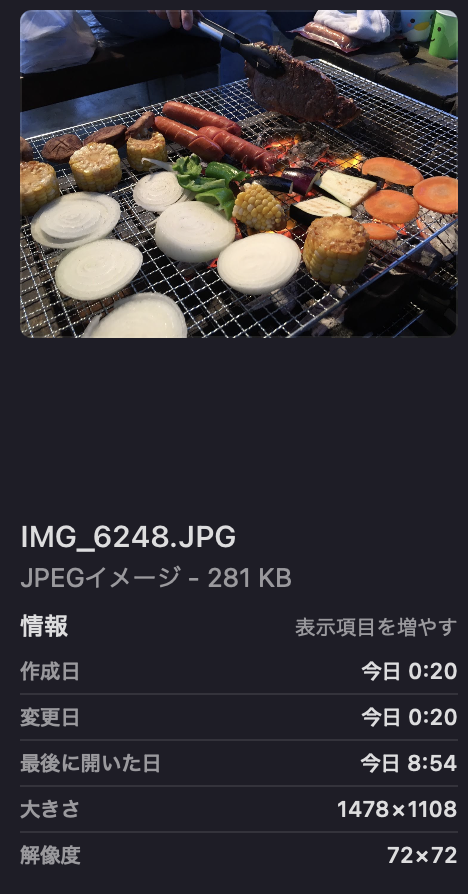
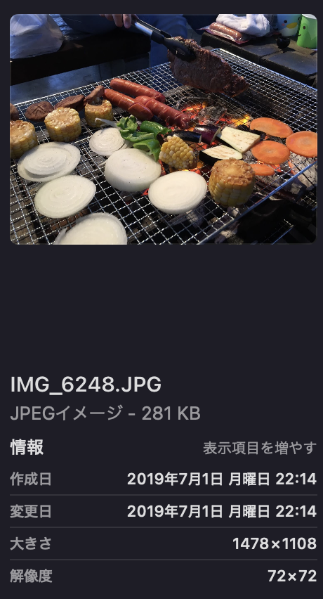

# timestamp
googlephotoからアーカイブ形式でダウンロードした写真のタイムスタンプを変更するプログラム。
手元のNASにgoogleフォトから移動するときにタイムスタンプがずれてしまったので作成しました。
アーカイブ形式での一括ダウンロード方法は[こちら](https://support.google.com/accounts/answer/3024190?sjid=16825085842255200521-AP)を参考にしてください。

## 環境構築
`dokcer compose`にて環境構築を行う。


```sh
$ cd .env_files
$ docker compose up -d
```

## 解凍したアーカイブファイルの中身
[こちら](https://support.google.com/accounts/answer/3024190?sjid=16825085842255200521-AP)を参考にダウンロードしたアーカイブ形式のファイルを解凍したときの中身はこんな構造。

```sh
$ tree
.
├── Google フォト
│   ├── アルバム名
│   │   ├── IMG_2439.JPG
│   │   ├── IMG_2439.JPG.json
│   │   ├── IMG_2440.JPG
│   │   ├── IMG_2440.JPG.json
.
.
.
```
JPGのメタ情報を見てみると、ダウンロードした日が作成日になっている。



この写真は明らかに5年以上前に取った写真なのだが、作成日が今日になっている。

そこで、同じファイル名のjsonファイルの中身を見ると。

```.json
{
  "title": "IMG_6248.JPG",
  "description": "",
  "imageViews": "0",
  "creationTime": {
    "timestamp": "1561986860",
    "formatted": "2019/07/01 13:14:20 UTC"
  },
  "photoTakenTime": {
    "timestamp": "1561986555",
    "formatted": "2019/07/01 13:09:15 UTC"
  },
  "geoData": {
    "latitude": 0.0,
    "longitude": 0.0,
    "altitude": 0.0,
    "latitudeSpan": 0.0,
    "longitudeSpan": 0.0
  },
  "geoDataExif": {
    "latitude": 0.0,
    "longitude": 0.0,
    "altitude": 0.0,
    "latitudeSpan": 0.0,
    "longitudeSpan": 0.0
  },
  "url": "https://url_to_googlephoto.com",
  "googlePhotosOrigin": {
    "mobileUpload": {
      "deviceType": "IOS_PHONE"
    }
  }
}
```

jsonファイルの中にメタデータが書き込まれているよう。
なのでjsonファイルから読み取ったデータをもとに写真(PNG)のメタデータを書き換える。


## 実行方法
`src/`内にある[timestamp.py](src/timestamp.py)を実行する。
引数に対象にしたい画像ファイル名を指定すると、指定した名前と同じjsonファイルを読み込んでメタ情報を書き換える。

```bash
$ python timestamp.py /work/test_file/IMG_6248.JPG

before
(datetime.datetime(2024, 2, 10, 0, 14, 46), datetime.datetime(2024, 2, 9, 15, 20, 5), datetime.datetime(2024, 2, 10, 0, 14, 47))
<change timstamp>
after
(datetime.datetime(2024, 2, 10, 0, 27, 17), datetime.datetime(2019, 7, 1, 13, 14, 20), datetime.datetime(2019, 7, 1, 13, 9, 15))
```

実行した結果の写真がこちら


ちゃんと作成日が変更された。